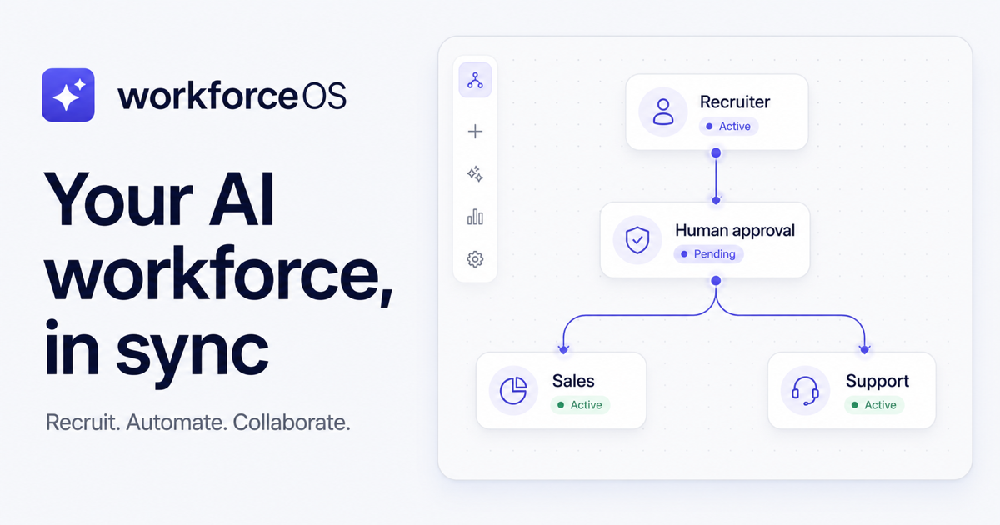

# WorkforceOS

[](https://github.com/Anubhav-2005/workforceos/actions/workflows/quality.yml)


WorkforceOS is an operating system for teams of AI employees. It gives people one place to assign work, review decisions, coordinate handoffs, and understand what their AI workforce accomplished.

This repository is a functional hackathon MVP built by [Anubhav Pandey](https://github.com/Anubhav-2005).



## The problem

Most AI tools work alone. A recruiter can review a resume, a sales assistant can draft an email, and a support assistant can prepare an answer—but the work still has to be moved between tools by a person.

That creates three practical problems:

- teams cannot see what their AI tools are doing in one place;
- handoffs between tools are manual and easy to lose;
- important decisions lack a clear human approval point.

## Our solution

WorkforceOS treats AI tools as members of a coordinated workforce. Each AI employee has a role, task queue, status, and performance view. The Workforce Engine connects those employees into a visible workflow and pauses when a human decision is required.

The MVP keeps product state in the browser so it is easy to run and judge. Resume analysis is the exception: PDFs are validated and processed by a server-only route that calls the OpenAI Responses API without exposing the API key.

## Core features

### AI Recruiter

- Upload a PDF resume by browsing or drag and drop.
- Validate the file type, signature, size, and extracted text.
- Generate a strict, structured hiring analysis with OpenAI.
- Review skills, strengths, weaknesses, experience, score, decision, and recommended role.
- Move candidates through approval, rejection, and interview-request states.
- Keep the local candidate pipeline between sessions.

### AI Sales Executive

- View assigned outreach work and progress.
- Pause or resume the employee.
- Assign new work from the shared task modal.
- Review activity, performance, and approval state.

### AI Customer Support

- Monitor support work and completion progress.
- Assign new work and review recent activity.
- Keep human review available for sensitive responses.

### Workforce Engine

- Create, rename, duplicate, enable, disable, and delete workflows.
- Run an animated collaboration from resume upload to onboarding.
- Pause execution for a human approval.
- Approve and resume, or reject and stop the workflow.
- Follow a live execution log and workflow analytics.
- Persist workflow configuration and the latest run locally.

### Analytics dashboard

- Review workforce throughput, reclaimed time, success rate, and satisfaction.
- Switch between weekly, monthly, and quarterly views.
- Inspect daily efficiency.
- Export the current report as CSV.

## Live demo

The public Vercel URL will be added here after the production environment variables are configured.

> Live demo placeholder: `https://your-workforceos-project.vercel.app`

## Screenshots

The social preview above shows the main product direction. Add final captures after the Vercel deployment so the screenshots match the submitted build.

| Surface          | Screenshot slot                    |
| ---------------- | ---------------------------------- |
| Dashboard        | `docs/assets/dashboard.png`        |
| AI Recruiter     | `docs/assets/recruiter.png`        |
| Workforce Engine | `docs/assets/workflow-engine.png`  |
| Mobile dashboard | `docs/assets/mobile-dashboard.png` |

## Demo GIF

> Demo GIF placeholder: record the flow from resume upload through human approval and workflow completion, then save it as `docs/assets/workforceos-demo.gif`.

## Tech stack

- Next.js 16 App Router
- React 19
- TypeScript
- Tailwind CSS 4
- Framer Motion
- OpenAI Node SDK and Responses API
- `pdf-parse` for server-side PDF text extraction

## Architecture

```text
Browser
  ├─ Dashboard shell and navigation
  ├─ Local tasks, settings, candidates, and workflows
  └─ PDF upload
         │
         ▼
Next.js Route Handler
  ├─ Request limiting
  ├─ File and PDF validation
  ├─ Text extraction
  └─ Strict structured-output request
         │
         ▼
OpenAI Responses API
```

The OpenAI client lives in one server-only module: `src/lib/openai.ts`. Client components never import it. They call `src/services/recruiter.ts`, which sends the PDF to `src/app/api/recruiter/analyze/route.ts`.

Product records intentionally use `localStorage` in this MVP. The state helpers and service boundaries keep a future database migration separate from the UI.

More detail is available in [docs/architecture.md](./docs/architecture.md).

## Installation

### Prerequisites

- Node.js 20.9 or newer
- npm
- An OpenAI API project with available API credits

Clone and install:

```bash
git clone https://github.com/Anubhav-2005/workforceos.git
cd workforceos
npm install
cp .env.example .env.local
```

## Environment variables

Add the following values to `.env.local`:

```env
OPENAI_API_KEY=your_openai_api_key
NEXT_PUBLIC_APP_URL=http://localhost:3000
```

| Variable              | Required            | Purpose                                                                  |
| --------------------- | ------------------- | ------------------------------------------------------------------------ |
| `OPENAI_API_KEY`      | For resume analysis | Server-side OpenAI credential. Never expose or commit it.                |
| `NEXT_PUBLIC_APP_URL` | Recommended         | Absolute URL used for canonical metadata, the sitemap, and social cards. |

If `OPENAI_API_KEY` is missing, the rest of the app remains usable and the Recruiter shows a configuration message instead of crashing.

## Running locally

```bash
npm run dev
```

Open [http://localhost:3000](http://localhost:3000).

Useful checks:

```bash
npm run lint
npm run typecheck
npm run format:check
npm run build
```

## Deployment

### Vercel

1. Import `Anubhav-2005/workforceos` into Vercel.
2. Add `OPENAI_API_KEY` as a secret environment variable.
3. Add `NEXT_PUBLIC_APP_URL` with the final `https://...vercel.app` URL.
4. Deploy with the default Next.js build command.
5. Redeploy once after setting or changing environment variables.
6. Verify resume analysis, human approval, workflow execution, CSV export, and mobile navigation.

No `vercel.json` is required for the current architecture. The Recruiter API route explicitly uses the Node.js runtime and allows up to 60 seconds for PDF extraction and analysis.

See [docs/deployment.md](./docs/deployment.md) for the complete deployment and verification procedure.

## Folder structure

```text
.
├── docs/                         # Hackathon, architecture, demo, and launch material
├── public/                       # Product metadata assets
├── src/
│   ├── app/
│   │   ├── api/recruiter/        # Secure resume analysis route
│   │   └── dashboard/            # App Router pages and route boundaries
│   ├── components/
│   │   ├── dashboard/            # Shared shell and dashboard pages
│   │   ├── recruiter/            # Recruiter workspace and analysis UI
│   │   └── workflow/             # Workforce Engine and simulation
│   ├── constants/                # Navigation configuration
│   ├── lib/                      # Environment, OpenAI, prompts, and domain data
│   ├── services/                 # Client API and workflow services
│   └── types/                    # Domain types and runtime validation
└── PROJECT_RELEASE_CHECKLIST.md
```

## Security notes

- Secrets are read only from server-side environment variables.
- Uploaded PDFs are limited to 5 MB and checked by MIME type, extension, and file signature.
- Extracted resume text is bounded before it is sent to OpenAI.
- OpenAI responses use strict JSON Schema and are validated again by the application.
- OpenAI response storage is disabled for this request.
- API responses are not cached.
- The MVP includes per-instance request limiting.

For a multi-instance production rollout, replace the in-memory limiter with a shared rate-limit store such as Vercel KV or Upstash Redis.

## Future scope

- Authentication, workspaces, and role-based permissions
- Database-backed tasks, candidates, and workflow runs
- Durable workflow execution and retries
- Shared rate limiting and job queues
- CRM, helpdesk, calendar, email, and HRIS integrations
- Audit trails, observability, and evaluation dashboards
- Additional specialized AI employees

The planned sequence is documented in [docs/future-roadmap.md](./docs/future-roadmap.md).

## Contributors

- [Anubhav Pandey](https://github.com/Anubhav-2005) — product, design, and engineering

Contributions are welcome. Read [CONTRIBUTING.md](./CONTRIBUTING.md) before opening a pull request.

## License

WorkforceOS is released under the [MIT License](./LICENSE).
