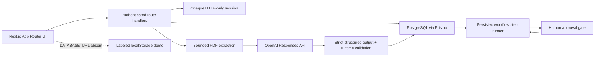

# Architecture

WorkforceOS has two explicit operating modes. The original browser-local demo runs when `DATABASE_URL` is absent and is marked with an amber banner. The connected mode uses PostgreSQL for shared, tenant-scoped work and requires sign-in. Neither mode claims that an external email or ATS action has happened.

## System view

## Application boundaries

- `src/app/dashboard` provides route boundaries and the shared shell. Server components select connected or demo screens; client components own interactions, dialogs, uploads, and animation.
- `src/app/api/auth` creates and revokes opaque session tokens. Only a SHA-256 token hash is stored in the database; cookies are HTTP-only, SameSite Lax, and Secure in production. Workspace membership and role checks happen on each connected request.
- `src/app/api/recruiter/analyze` accepts an authenticated multipart PDF, bounds the body before parsing, validates file signature and text, calls the Responses API through `src/lib/openai.ts`, validates its strict JSON output, and persists candidate/analysis/approval records. Raw PDF bytes are discarded after extraction.
- `src/lib/workflows/graph.ts` validates graph structure before activation. `src/lib/workflows/runner.ts` claims one persisted node at a time, records step state, pauses for human approval, and resumes only after a recorded decision. AI employee nodes call the server-side model adapter; action nodes currently save drafts internally. No external connector is invoked.
- Tasks are separate assignments. The task runner produces a saved AI draft and records success/failure. Analytics is derived from persisted tasks, approvals, executions, and token events; connected screens never show fabricated productivity numbers.

## Data model

The Prisma schema is in `prisma/schema.prisma`, with the initial migration in `prisma/migrations`. Core records include users, organizations, memberships, sessions, AI employees, tasks, task executions, workflows, nodes, edges, workflow executions and steps, approvals, candidates, resume analyses, activity, notifications, and audit logs. Each route scopes queries to the current organization. Candidate deletion removes linked candidate data and completed run history; active runs must be finished or cancelled first.

The local demo path is intentionally separate. It uses browser `localStorage` for fictional candidates and simulated workflow interactions, so judges can inspect the UI without a database or API spend. It is not a shared workspace and cannot invoke the live AI route anonymously.

## Security and limitations

- Server-only environment variables protect database and OpenAI credentials; no secret is imported by client components.
- Mutating routes check same-origin requests, input schemas, workspace membership, and role permissions.
- PDFs are limited to 4 MB so multipart overhead remains under Vercel's body limit; pages and extracted characters are bounded.
- Model output is untrusted data even when generated with strict JSON Schema. Hiring scores are decision support; human review is mandatory.
- Requests use `store: false` with OpenAI. The app stores the structured analysis and audit metadata, but not the raw PDF.
- The current limiter is in-memory per process, not distributed. For high-volume production use, add a shared limiter, independent job worker, idempotent retries, secret management for connectors, and operational alerting.
