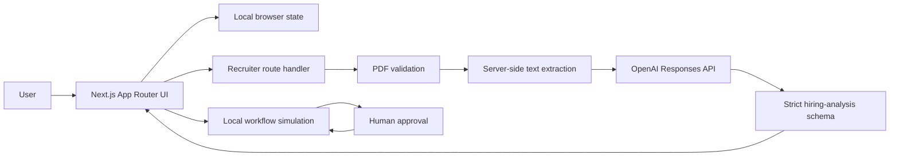

# Architecture

WorkforceOS uses a small, explicit architecture suited to a two-day MVP while leaving clean seams for production services.

## System view

## Application layers

### App Router

Pages and route boundaries live in `src/app`. Each dashboard route has a small server component that provides metadata and renders the relevant feature component.

### Dashboard shell

`DashboardShell` owns navigation, shared notifications, the task modal, and locally persisted work activity. Interactive pages consume that state through a focused React context.

### Recruiter domain

The Recruiter is split into tabs and reusable presentation components. Candidate state is persisted locally. Resume analysis crosses a service boundary:

1. `ResumeUploader` validates the first client-side constraints.
2. `services/recruiter.ts` sends the PDF to the internal API and reports upload progress.
3. The route handler validates the request and PDF again.
4. `pdf-parse` extracts bounded text on the server.
5. The singleton OpenAI client sends a Responses API request with a strict JSON Schema.
6. The server validates the returned JSON before sending it to the browser.

### Workforce Engine

Workflow definitions, runtime status, and execution logs are typed domain objects. The simulation hook advances nodes with short delays, pauses at human approval, and resumes or fails based on the decision.

## Server and client boundaries

- API keys, PDF parsing, prompts, and the OpenAI SDK client are server-only.
- Browser APIs, local storage, file selection, animation, and interaction live in client components.
- Client code communicates with OpenAI only through the internal `/api/recruiter/analyze` route.
- Non-`NEXT_PUBLIC_` environment variables are never bundled for the browser.

## Data and persistence

The MVP stores tasks, settings, candidates, workflows, and the latest workflow run in `localStorage`. This removes account and database setup from the judging flow.

The persistence hook validates stored data before using it. Invalid or inaccessible values fall back to safe defaults.

## Security controls

- 5 MB PDF limit
- PDF MIME, extension, and signature checks
- minimum extracted-text threshold
- bounded resume text sent to the model
- prompt-injection boundary for untrusted resume text
- strict JSON Schema output
- application-side response validation
- request timeout and no automatic SDK retries
- `store: false` on the OpenAI request
- no-store API responses
- per-instance request limiting
- safe, non-sensitive error responses

## Production evolution

The current boundaries map directly to production services:

- replace local storage with Postgres or another durable store;
- move workflow simulation to a durable job runner;
- use a shared distributed rate limiter;
- add authentication and workspace authorization;
- add encrypted object storage with a retention policy if original resumes must be retained;
- add tracing, model evaluations, and cost monitoring.
